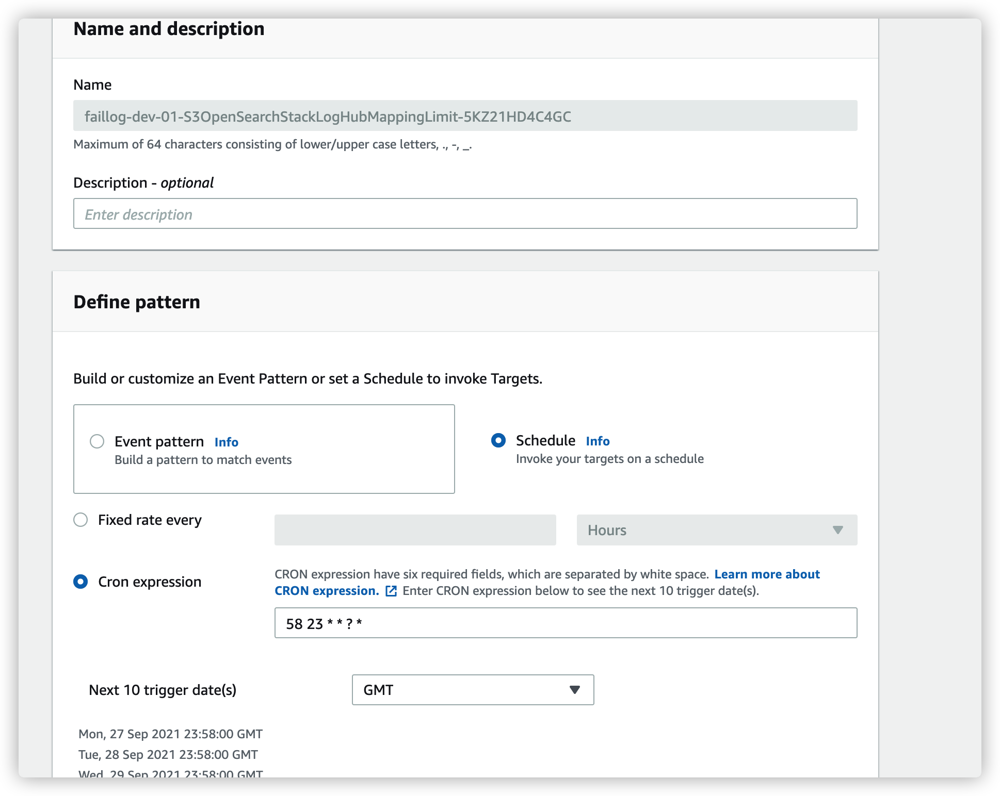
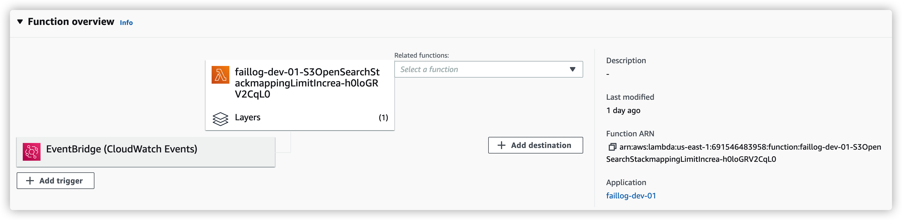

# Log Hub Repo
This is the repo for write logs into Amazon Elastic Search.

Meanwhile this project still in POC progress. It will be moved to Amazon Web Services' offical repo soon.

### Supported service:

* CloudTrail
* S3 Access Log

## User Guide

### Config Log Sender

1. Clone this repo.
1. Create a Lambda function.
1. Copy these function into the Lambda:
    * index.js
    * common.js
    * S3AccessWorker.js
    * CloudTrailWorker.js
1. Config the Lambda Environment variables

    | Key | Value |
    | :----| :---- | 
    | LOG_TYPE | CLOUDTRAIL or S3ACCESS | 
    | ES_ENDPOINT | vpc-xxxxxx-xxxxxxxxxx.us-east-1.es.amazonaws.com | 
    | DOMAIN_NAME | xxxxxxx | 
    | FAILED_LOG_BUCKET_NAME | your failed log bucket | 

1. Config the Lambda Role to attach the policy to `Allow: s3:PutObject` to the FAILED_LOG_BUCKET

> Note: If your ElasticSearch is in VPC, then you should create a Lambda in the same VPC or using VPC Peering.

### Config OpenSearch/AES Helper
This Helper function will automatically increase the indexes' field's upper limit and set the ignore_malformed to true.

1. Create a Lambda function.
1. Copy the codes under the `openSearchHelper` Folder
1. Config the Handler of the Lambda to `increaseMappingLimit.lambda_handler`
1. Config the Lambda Environment variables

    | Key | Value |
    | :----| :---- | 
    | LOG_TYPE | CLOUDTRAIL or S3ACCESS | 
    | ES_ENDPOINT | vpc-xxxxxx-xxxxxxxxxx.us-east-1.es.amazonaws.com | 
    | INDEX_NAME | xxxxxxx | 

1. Make a Lambda Layer accourding to the `openSearchHelper/layer/requirements.txt`, and config the lambda's layer
1. Config the Event Rule to `'cron(58 23 * * ? *)'` and add this to the Lambda Trigger

## How to Build the Source Code

1. You need install npm, suggest version 6.14.5
1. `cd loghub-cloudtrail-s3-es`
1. run `npm -i`
1. After that, you can modify the code in *.ts file, they will be build into *.js file. **Remember to modify the Lambda Environment variables**
1. run `npm run build`
